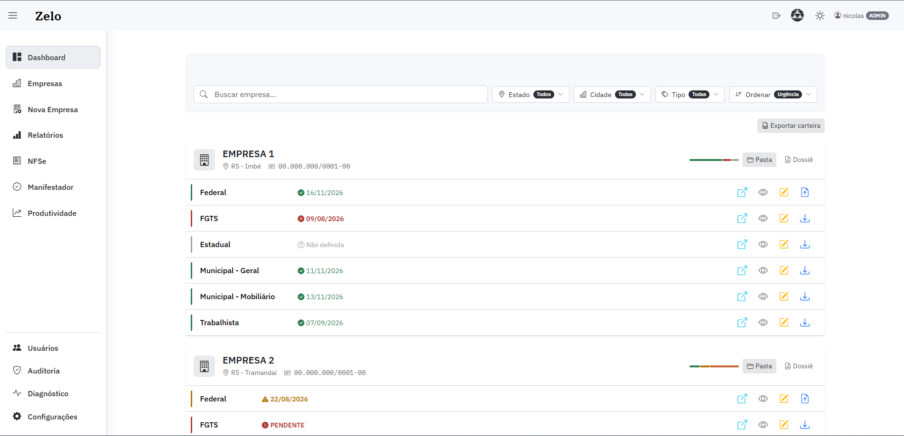

  

  <h1>Zelo</h1>

  

    <b>Regularidade sob controle.</b> 
    Automação das rotinas fiscais que se repetem todo mês e têm prazo: 
    certidões dos clientes, NFS-e de honorários e manifestação de NF-e.
  

  

    
    
    
    
    
  

  

    <a href="#por-que-existe">Por que existe</a> •
    <a href="#os-três-pilares">Os três pilares</a> •
    <a href="#destaques-técnicos">Destaques técnicos</a> •
    <a href="#stack">Stack</a> •
    <a href="#documentação">Documentação</a>
  

---

<!-- VÍDEO: arraste o .mp4 para o corpo de um issue deste repositório; o GitHub
     devolve uma URL https://github.com/user-attachments/assets/... Cole essa URL
     sozinha numa linha, logo abaixo desta, e ela vira um player.
     Anexo, e não arquivo commitado, de propósito: um vídeo no repo entra no
     histórico do git e não sai mais de lá. -->

  <picture>
    <source media="(prefers-color-scheme: dark)" srcset="docs/dashboard-dark.png">
    
  </picture>
   
  <i>Dashboard: o status de toda a carteira numa tela. Claro e escuro são entregas iguais</i>

---

## Por que existe

Um escritório contábil refaz, todo mês, o mesmo conjunto de tarefas com prazo legal: emitir certidões que vencem, transformar o extrato do banco em notas de honorários e manifestar as NF-e recebidas pelos clientes dentro da janela permitida. É trabalho repetitivo, sensível a data e caro de errar.

**Zelo** automatiza esse ciclo de ponta a ponta, da consulta ao portal público até o PDF arquivado na pasta certa da empresa. Do lado dos clientes: controle visual de vencimentos, organização automática dos documentos e apoio ao acompanhamento de débitos, já que uma certidão pendente costuma sinalizar pendência na respectiva esfera fiscal ou trabalhista. Do lado do escritório: o extrato bancário vira as notas do mês sem redigitar cliente por cliente.

O nome batiza o sistema de uso interno. A identidade é monocromática (grafite sobre papel) e reserva cor para uma coisa só: **o status da certidão**.

## Os três pilares

| Pilar | O que resolve | Documentação |
| --- | --- | --- |
| **Certidões fiscais** | Emissão e controle das certidões Federal, FGTS, Estadual, Municipal e Trabalhista, individual e em lote, sobre portais públicos reais (RFB, Caixa, SEFAZ RS, prefeituras, TST). Agendador diário emite o que está vencendo e avisa por e-mail. | [docs/CERTIDOES.md](docs/CERTIDOES.md) |
| **NFS-e de honorários** | Do extrato bancário à nota emitida no Emissor Nacional: lê o CSV do Banrisul e o PDF do Inter, casa cada lançamento com o cliente e preenche o assistente até a tela de revisão. | [docs/NFSE.md](docs/NFSE.md) |
| **Manifestador de NF-e** | Manifestação do destinatário direto no webservice da SEFAZ, sem navegador, sem `.jnlp` e sem o assinador Java, com cofre dos certificados A1 da carteira. | [docs/MANIFESTADOR.md](docs/MANIFESTADOR.md) |

<!-- SEÇÃO "TELAS": entra aqui quando houver prints das outras partes do sistema.
     Candidatas: NFS-e (fila de notas), Manifestador (chaves e cofre), Relatórios,
     Diagnóstico (saúde dos portais) e o painel de andamento do lote. O padrão é o
     mesmo bloco <picture> do topo quando houver os dois temas, ou só  quando
     houver um. Lembrar de acrescentar "Telas" no índice do cabeçalho. -->

## Destaques técnicos

Cada decisão abaixo existe porque o erro correspondente é caro de desfazer.

| Destaque | O que o sistema faz |
| --- | --- |
| **Freio onde o erro é caro** | Na NFS-e a automação preenche as três etapas e **para na tela de revisão**: quem emite é o operador, porque o desfazer não é rollback, é cancelamento de nota. O modo automático existe, mas é escolha explícita a cada lote e só emite após auto-revisão de documento, valor e descrição. |
| **Casamento que prefere não decidir** | O banco manda a razão social truncada em 35 caracteres. O vínculo nome→CNPJ só é automático quando o match é bom **e** folgado sobre o segundo colocado; ambíguo vai para conferência manual, porque errar é emitir nota com o CNPJ de outro cliente. |
| **Manutenção preventiva** | Um **dry-run** diário percorre o fluxo real de cada município até a fronteira da emissão e aponta o seletor que quebrou, sem emitir nada e sem gastar solver. |
| **Freio automático de portal fora** | Três falhas seguidas abrem um *circuit breaker*: o lote para em estado retomável e sai alerta por e-mail, em vez de queimar créditos de solver. Portal municipal para sozinho, os outros seguem; o bloqueio expira sem intervenção. O que esgotou tentativas volta à fila com um clique, agrupado por motivo. |
| **PDF salvo precisa ser certidão** | Antes de gravar validade, um gate confere texto e vocabulário de certidão: página de erro do portal é descartada e vira falha com retry, não certidão "válida" no painel. Reprova só por evidência negativa, para não quebrar fluxos que funcionam. |
| **Cadastro que se defende sozinho** | CNPJ validado por dígito verificador, dados da Receita via BrasilAPI com fallback ReceitaWS. Campo vazio é preenchido; campo divergente é **sinalizado, nunca sobrescrito** (a automação municipal casa cidade por string). CNPJ baixado sai do lote automático. |
| **Observabilidade de verdade** | Saída dupla (console + `app.jsonl`), `request_id` por requisição e `execution_id` por lote, erros traduzidos em título + causa + ação, preflight antes de emitir e detector de recorrência com hipótese de causa. |
| **Segurança no uso diário** | Autenticação *deny-by-default* por `before_request` global (rota nova nasce protegida), três papéis hierárquicos, CSRF, trilha de auditoria, PDF por token assinado e expirável, segredos só via ambiente. |
| **CI com paridade de banco** | Dois jobs paralelos: lint + suíte em SQLite (gate rápido) e a suíte inteira contra **MySQL 8.0**, pegando divergência de enum, colação e tipo antes da produção, mais um teste de migração idempotente (`upgrade → downgrade → upgrade`). |
| **Assinatura fiscal sem framework** | A manifestação de NF-e assina XMLDSig e fala SOAP com a SEFAZ usando só a biblioteca padrão + `cryptography`, sem `lxml`, `signxml` ou `zeep`. A equivalência da canonicalização foi **medida contra 3 NF-e reais assinadas** (digest byte a byte, assinatura RSA verificada) antes de escrever a primeira linha do fluxo. |
| **Certificado casado por prova, não por nome** | Cada empresa é ligada ao seu `.pfx` pelo CNPJ que está **dentro** do certificado, o único identificador que a autoridade certificadora garante. Nome de arquivo, de pasta e razão social não servem: variam de grafia, se repetem entre titulares e às vezes nem são um nome. O `.pfx` nunca é copiado: só caminho e senha cifrada. |
| **Reuso deliberado** | Um motor de lotes para seis fluxos e núcleos únicos de captcha de imagem, política de certificado do Chrome e classificação de PDF. Cada cópia seria uma divergência silenciosa entre dois portais. |

## Stack

| Camada | Tecnologias |
| --- | --- |
| Backend | Python 3.10+, Flask, SQLAlchemy 2.0 / Flask-Migrate, Flask-Login, Flask-WTF, APScheduler |
| Automação | Selenium, undetected-chromedriver, 2captcha, pdfplumber, certificado digital A1/A3 via política do Chrome |
| Integrações | BrasilAPI e ReceitaWS (consulta de CNPJ) via `requests`; webservices da SEFAZ (NF-e) por SOAP + mTLS, com XMLDSig assinado pela biblioteca padrão + `cryptography` |
| Frontend | Jinja2, Bootstrap 5.3 com identidade própria (design tokens, IBM Plex, dark/light), JS vanilla (ES modules, sem bundler) |
| Dados | MySQL 8.0 (produção), SQLite (desenvolvimento) |
| Documentos | openpyxl (XLSX), pypdf + fpdf2 (dossiê PDF), thefuzz (casamento de nomes) |

## Documentação

- [Certidões fiscais](docs/CERTIDOES.md) — automação por tipo, lotes, agendador e relatórios
- [NFS-e de honorários](docs/NFSE.md) — do extrato bancário à nota emitida
- [Manifestador de NF-e](docs/MANIFESTADOR.md) — cofre de certificados, chaves de acesso e manifestação pelo webservice
- [Instalação e configuração](docs/OPERACAO.md) — requisitos, `.env`, Docker, observabilidade e testes

## Licença

Software proprietário: **todos os direitos reservados** (veja [LICENSE](LICENSE)).

O repositório é público apenas para fins de **estudo, demonstração e portfólio**: o código pode ser visualizado e lido, mas **não** há permissão para usar, executar, copiar, modificar ou redistribuir. Não é um projeto open-source. Para qualquer uso além da visualização, é necessária autorização prévia e por escrito do autor.

  Zelo · Assecon Assessoria e Contabilidade

